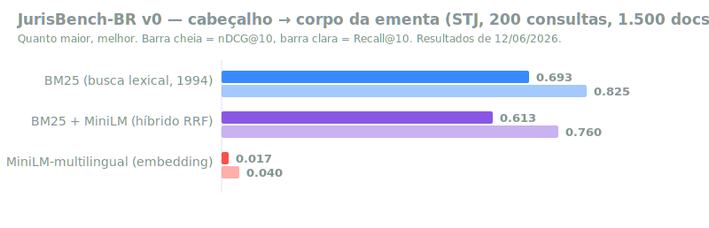

<div align="center">

# ⚖️ JurisBench-BR

### The first open benchmark for legal semantic search in Brazilian Portuguese

**A 1994 algorithm beats every modern AI embedding model on Brazilian case law — by huge margins.**

[](LICENSE)
[](https://www.python.org/)
[](https://github.com/ThalesAndrades/JurisBench-BR/actions/workflows/ci.yml)
[](CONTRIBUTING.md)
[](LEADERBOARD.md)

[🇧🇷 Português](README.md) · 🇺🇸 English

</div>

---

## 💥 TL;DR

We tested the world's most-used open embedding models on a realistic Brazilian legal search task (retrieving the correct ruling from Brazil's Superior Court of Justice among 1,500 decisions). **Every single one lost — badly — to BM25, a 30-year-old keyword-matching algorithm:**



| Model | nDCG@10 | Recall@10 |
|---|---:|---:|
| 🥇 **BM25 (lexical search, 1994)** | **0.771** | **0.895** |
| bge-m3 *(multilingual state of the art)* | 0.441 | 0.620 |
| serafim-335m *(Portuguese state of the art)* | 0.170 | 0.260 |
| MiniLM-multilingual *(world's most downloaded embedding)* | 0.040 | 0.080 |

> **If your legal RAG pipeline uses generic embeddings, it is probably worse than the keyword search it replaced.**

⭐ **Surprised?** Star the repo to follow upcoming versions and share it.

## 🔍 Why this matters

Thousands of legaltechs, law firms and courts in Brazil are building RAG systems on top of embeddings **trained mostly on English and generic text**. The vocabulary, morphology and document structure of Brazilian law (headnotes, rulings, CNJ-standard numbered theses) are **out of distribution** for all of them.

JurisBench-BR exists to:

1. **Measure** — quantify, with an open and reproducible methodology, how poorly generic semantic search performs on Brazilian legal text;
2. **Compare** — give the community a public leaderboard for any new model;
3. **Improve** — serve as an objective target for specialized models (first goal: **beat BM25**, which no open embedding can do today).

## 🧪 The task (v0)

Realistic legal search: given the **thematic header** of an STJ headnote (e.g. *"DIREITO PENAL. AGRAVO REGIMENTAL. TRÁFICO PRIVILEGIADO..."*), retrieve the **body of the corresponding ruling** (CNJ-standard numbered theses) from a corpus of **1,500 real decisions**. **200 queries**, scored with **nDCG@10** and **Recall@10**.

The data are public judicial decisions of the Superior Tribunal de Justiça — official acts, not subject to copyright (Brazilian Law 9.610/98, art. 8, IV), via the [`celsowm/jurisprudencias_stj`](https://huggingface.co/datasets/celsowm/jurisprudencias_stj) dataset.

## ⚡ Reproduce it in 3 commands

Runs on free Colab (T4) or local CPU:

```bash
git clone https://github.com/ThalesAndrades/JurisBench-BR.git && cd JurisBench-BR
pip install -r requirements.txt
python jurisbench_v0.py   # results written to results/
```

Want to test **your own model**? Add its HuggingFace repo to the `MODELS` dict in [`jurisbench_v0.py`](jurisbench_v0.py) and run. Then [submit it to the leaderboard](LEADERBOARD.md) 🏆.

> 🔒 Models that require `trust_remote_code` (custom code in the model repo) are **disabled by default**: enable with `JURISBENCH_TRUST_REMOTE_CODE=1` only for repos you have audited — see the [security policy](SECURITY.md).

## 🏆 Leaderboard and private test set

To prevent overfitting and contamination, **part of the evaluation set is private**. Submissions are evaluated by us and published on the [leaderboard](LEADERBOARD.md).

👉 **[Submit your model via the form](https://github.com/ThalesAndrades/JurisBench-BR/issues/new?template=02-jurisbench-submissao.yml)** — takes 2 minutes.

## 🧭 Known limitations of v0 (honesty first)

- Lexical overlap between header and body favors BM25; **v1 will add natural-language queries** (layperson question → case law), where the lexical advantage disappears.
- Single source (STJ) and a 1,500-document corpus; v1 will expand to TJSP/STF.
- One relevant document per query (v1 will have graded relevance judgments).
- `google/embeddinggemma-300m` not yet evaluated (gated repository).

Found another limitation? [Open an issue](https://github.com/ThalesAndrades/JurisBench-BR/issues) — methodological criticism is a first-class contribution here.

## 🗺 Roadmap

- [x] **v0** — header→body task, BM25 + 3 embedding baselines *(Jun 2026)*
- [ ] **v1** — natural-language queries, more courts (TJSP/STF), formalized private test set
- [ ] **Automated leaderboard** — submissions via PR, evaluated on the private test set
- [ ] **JurisEmbed-BR** — THM's open model with a publicly declared goal: **beat BM25 on this task**

## 🤝 Contributing

Every contribution counts — the most valuable ones don't even require code:

- ⭐ **Star and share** — the more people know generic embeddings fail on Brazilian legal text, the better for the ecosystem;
- 🔱 **Fork and test your model** — then submit the result;
- 🧠 **Methodological criticism** — issues challenging the benchmark design are welcome;
- 📚 **New tasks and courts** — see the [contribution guide](CONTRIBUTING.md).

## 📖 Citation

```bibtex
@misc{jurisbenchbr2026,
  author       = {Andrades, Thales},
  title        = {JurisBench-BR: an open benchmark for legal semantic retrieval in Brazilian Portuguese},
  year         = {2026},
  publisher    = {GitHub},
  howpublished = {\url{https://github.com/ThalesAndrades/JurisBench-BR}}
}
```

Or use [`CITATION.cff`](CITATION.cff) (GitHub renders it in the *"Cite this repository"* button).

## 📜 License

- **Code:** [Apache 2.0](LICENSE)
- **Data:** public judicial decisions — official acts, not subject to copyright (Brazilian Law 9.610/98, art. 8, IV)

---

<div align="center">

Maintained by [**THM Tecnologia**](APRESENTACAO-THM.md) — local AI and data sovereignty for the Brazilian market.

*Thales Andrades · thalesandradees@gmail.com*

</div>
